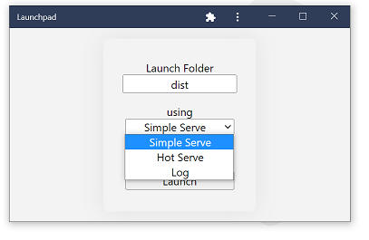

# Launchpad
Simple Desktop PWA used to launch Deno Dev Tools.

## Tools
- Simple Server - a Deno Dev Server that serves and opens index.html in the browser.   

- Hot Serve - like Simple above +:   
auto-ESBuild on any file changes, then hot reloads the browser.   

- Log - launches a remote logger application.   
Used in place of console.log for Deno Desktop applications (dwm apps).  

